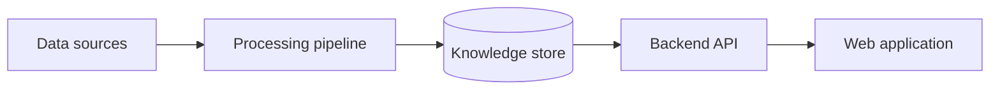

<div align="center">

# LucraftMeds

**A medical Retrieval-Augmented Generation platform** for collecting, processing,
retrieving, and presenting grounded healthcare information.

<br/>


</div>

---

## Overview

LucraftMeds is a Retrieval-Augmented Generation (RAG) project for medical
information. It is organized into independent backend, frontend, and notebook
workspaces so that data preparation, retrieval development, and the user
interface can evolve separately.

The current data workflow covers website crawling, preprocessing, semantic
chunking with configurable token limits, BGE-M3 embeddings, and ingestion into
Qdrant. The application layer is under active development.

<!--
## System Architecture

The system architecture diagram and its explanation will be added later.


-->

## Project Structure

```text
lucraftmeds/
├── lucraftmeds@be/                         # Backend and RAG pipeline
│   ├── api/                                # API layer
│   ├── chunking/                           # Semantic chunking and token limits
│   ├── tests/                              # Backend tests
│   ├── config.yaml                         # Runtime configuration
│   ├── main.py                             # Backend entry point
│   └── requirements.txt                    # Python dependencies
├── lucraftmeds@fe/
│   └── fe/                                 # Next.js web application
│       ├── app/                            # App Router pages and styles
│       ├── public/                         # Static assets
│       └── package.json                    # Frontend scripts and dependencies
├── lucraftmeds@notebooks/
│   ├── crawl4ai-dataset-creation/          # Website crawling and dataset tools
│   ├── chunkings/                          # Semantic chunking experiments
│   ├── domains-analyzation/                # Source-domain analysis
│   └── preprocessing.ipynb                 # Dataset preprocessing
└── README.md
```

## Getting Started

### Requirements

- Python `3.10+`
- Node.js `20+` and npm
- A running Qdrant instance for vector ingestion
- JupyterLab or Jupyter Notebook for the data workflows

### Backend

Run Python commands from the backend directory:

```bash
cd lucraftmeds@be
python3 -m venv .venv
source .venv/bin/activate
pip install -r requirements.txt
```

Store local environment variables and API keys in `lucraftmeds@be/.env`.
Never commit secrets to the repository.

The backend application entry point and its launch command will be documented
when the API implementation is finalized.

### Frontend

```bash
cd lucraftmeds@fe/fe
npm install
npm run dev
```

Open [http://localhost:3000](http://localhost:3000) in your browser.

Other useful commands:

```bash
npm run lint
npm run build
npm run start
```

## Data Pipeline

```text
Websites and documents
  → Crawl and extract Markdown
  → Analyze source domains
  → Clean and preprocess content
  → Create semantic chunks
  → Generate BGE-M3 embeddings
  → Upload vectors and metadata to Qdrant
  → Retrieve grounded context
  → Generate answers with source references
```

### Website crawling

Use the notebooks in `lucraftmeds@notebooks/crawl4ai-dataset-creation/` to
extract web content as Markdown and merge generated datasets. In a notebook,
run asynchronous Crawl4AI functions with `await`; use `asyncio.run(...)` only
from a regular Python script.

### Semantic chunking

Open
`lucraftmeds@notebooks/chunkings/bgem3-semantic-chunking.ipynb` and run its
cells in order. Place UTF-8 CSV files in `To read Data/` at the repository root,
or change the notebook's `DATA_DIR`. For CSV input, set `TEXT_COLUMN` to the
preprocessed text column; all other columns are preserved as metadata.

The notebook reuses `lucraftmeds@be/chunking/chunking.py`, generates BGE-M3
dense embeddings, and uploads chunks to Qdrant in batches. Chunk boundaries can
be controlled with minimum and maximum token limits.

Configure the following environment variables before ingestion:

| Variable | Default | Purpose |
| --- | --- | --- |
| `QDRANT_URL` | `http://localhost:6333` | Qdrant server URL |
| `QDRANT_API_KEY` | — | Authentication when required |
| `QDRANT_COLLECTION` | `lucraftmeds_bge_m3` | Destination collection |

Start Qdrant before running ingestion. Missing or empty input folders are
skipped. Unchanged input does not create duplicate points, but edits and
deletions may leave older vectors; use a new collection for a clean rebuild.
Existing collections are never deleted automatically.

## Development Conventions

- Run backend commands from `lucraftmeds@be/`.
- Keep backend tests in `lucraftmeds@be/tests/`.
- Keep secrets, logs, generated datasets, and local runtime files out of Git.
- Preserve source metadata throughout crawling, chunking, and retrieval.
- Update this README when adding entry points, dependencies, or services.

## Status

LucraftMeds is under active development. The crawling and semantic chunking
workflows are being established first; retrieval, generation, and API features
will be documented as they are implemented.
