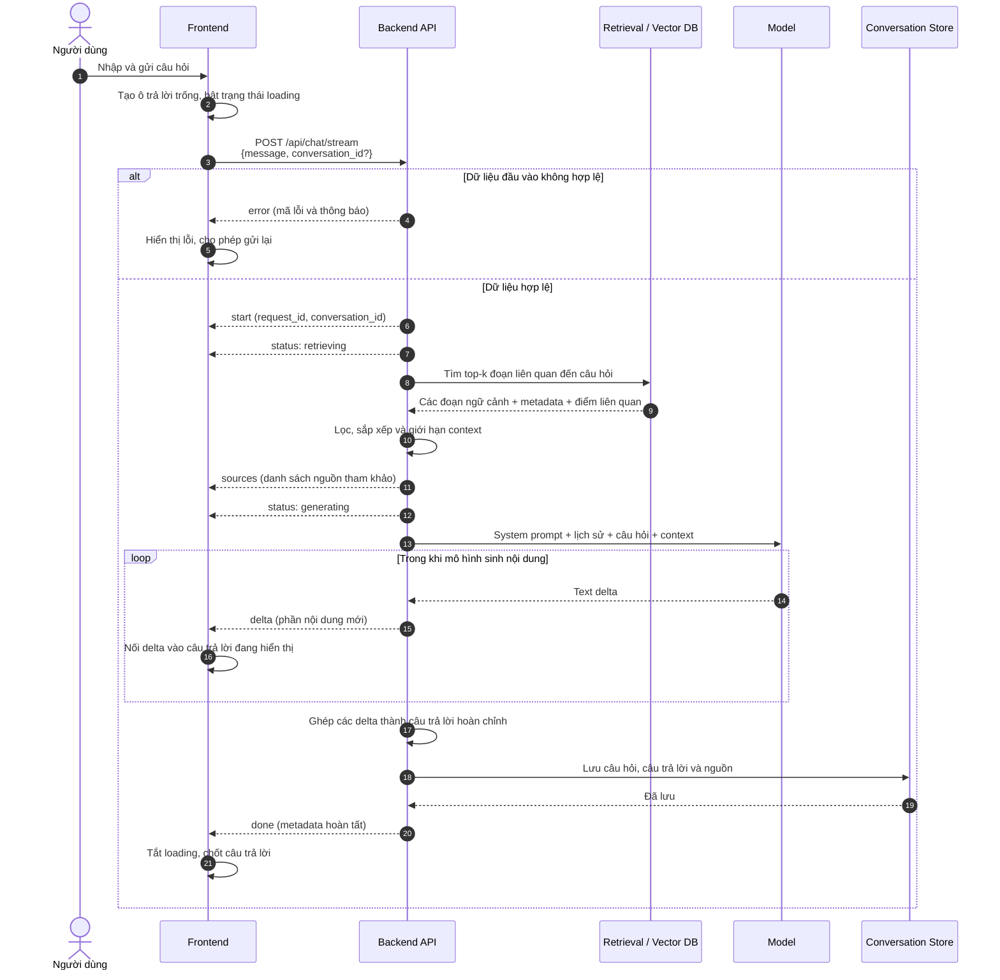

# Luồng sinh câu trả lời (RAG Streaming)

Tài liệu này mô tả luồng dự kiến khi người dùng gửi câu hỏi từ giao diện và nhận câu trả lời theo thời gian thực. Backend kết hợp **Retrieval-Augmented Generation (RAG)** để lấy ngữ cảnh từ kho tài liệu y khoa trước khi gọi mô hình ngôn ngữ.

> **Trạng thái hiện tại:** đây là đặc tả luồng thiết kế. Endpoint `POST /api/chat/stream` và phần retrieval/generation chưa được triển khai trong mã nguồn backend.

## Tổng quan

Luồng có bốn thành phần chính:

- **Frontend (UI):** nhận câu hỏi, mở kết nối streaming và cập nhật giao diện theo từng sự kiện.
- **Backend (API):** điều phối yêu cầu, kiểm tra đầu vào, gọi retrieval, tạo prompt, stream kết quả và lưu câu trả lời.
- **Retrieval (RAG):** tìm các đoạn tài liệu liên quan trong kho vector, rồi trả nội dung và thông tin nguồn.
- **Model (LLM):** sinh câu trả lời dựa trên câu hỏi và ngữ cảnh được cung cấp.



## Diễn giải từng bước

### 1. Frontend gửi câu hỏi

Khi người dùng nhấn gửi, frontend:

1. Kiểm tra câu hỏi không rỗng.
2. Thêm câu hỏi vào lịch sử hội thoại trên giao diện.
3. Tạo một ô trả lời rỗng và hiển thị trạng thái đang xử lý.
4. Gửi `POST /api/chat/stream`. Nếu đây là cuộc trò chuyện đã tồn tại, request nên kèm `conversation_id`.

Ví dụ payload:

```json
{
  "message": "Dấu hiệu thường gặp của tăng huyết áp là gì?",
  "conversation_id": "conv_123"
}
```

### 2. Backend khởi tạo stream

Backend xác thực dữ liệu đầu vào, tạo `request_id` để theo dõi yêu cầu và trả sự kiện `start`. Từ thời điểm này kết nối được giữ mở để backend gửi nhiều sự kiện trên cùng một HTTP response.

Nếu request không hợp lệ, backend trả sự kiện `error` và dừng luồng trước khi gọi retrieval hoặc model.

### 3. Retrieval tìm ngữ cảnh

Backend gửi trạng thái `retrieving`, sau đó chuyển câu hỏi thành truy vấn tìm kiếm trong kho vector. Retrieval lấy các đoạn tài liệu gần nhất, thường gồm:

- nội dung đoạn văn (`content`);
- tiêu đề hoặc tên tài liệu;
- URL/định danh nguồn;
- vị trí đoạn trong tài liệu;
- điểm tương đồng hoặc độ liên quan.

Backend lọc các kết quả dưới ngưỡng liên quan, loại nội dung trùng lặp và giới hạn tổng kích thước context để không vượt cửa sổ ngữ cảnh của model.

### 4. Gửi nguồn cho frontend

Sau retrieval, backend gửi sự kiện `sources` trước khi sinh câu trả lời. Frontend có thể hiển thị nguồn ngay hoặc lưu tạm để gắn vào câu trả lời khi hoàn tất.

Nếu không tìm được tài liệu đủ liên quan, backend vẫn có thể tiếp tục nhưng prompt phải yêu cầu model nói rõ rằng kho dữ liệu không có đủ căn cứ, thay vì tự suy đoán thông tin y khoa.

### 5. Model sinh câu trả lời

Backend tạo prompt từ bốn phần:

1. **System prompt:** vai trò, nguyên tắc an toàn và định dạng trả lời.
2. **Lịch sử hội thoại:** các lượt cần thiết để hiểu ngữ cảnh hiện tại.
3. **Context:** các đoạn tài liệu do retrieval trả về.
4. **Câu hỏi hiện tại:** nội dung người dùng vừa gửi.

Backend gửi trạng thái `generating` rồi gọi model ở chế độ streaming. Mỗi phần văn bản mới từ model được chuyển ngay thành sự kiện `delta`; frontend nối lần lượt các `delta` để tạo hiệu ứng câu trả lời xuất hiện theo thời gian thực.

### 6. Hoàn tất và lưu hội thoại

Khi model kết thúc, backend ghép toàn bộ `delta` thành câu trả lời hoàn chỉnh và lưu:

- câu hỏi của người dùng;
- câu trả lời cuối cùng;
- các nguồn đã sử dụng;
- `conversation_id`, `request_id` và thời gian xử lý;
- thông tin sử dụng model/token nếu cần theo dõi chi phí.

Sau khi lưu thành công, backend gửi `done`. Frontend tắt trạng thái loading, chốt nội dung và cho phép người dùng gửi câu hỏi tiếp theo.

## Hợp đồng sự kiện streaming

Transport có thể dùng **Server-Sent Events (SSE)** hoặc **NDJSON**, nhưng mọi sự kiện nên có cùng một cấu trúc bao ngoài để frontend xử lý thống nhất:

```json
{
  "type": "delta",
  "request_id": "req_456",
  "data": {}
}
```

| `type` | Thời điểm gửi | Nội dung chính trong `data` |
| --- | --- | --- |
| `start` | Request đã được chấp nhận | `conversation_id` |
| `status` | Trạng thái xử lý thay đổi | `stage`: `retrieving` hoặc `generating` |
| `sources` | Retrieval hoàn tất | mảng nguồn và metadata |
| `delta` | Model sinh thêm nội dung | `text` |
| `done` | Toàn bộ luồng hoàn tất | thống kê thời gian/token nếu có |
| `error` | Có lỗi ở bất kỳ bước nào | `code`, `message`, `retryable` |

Ví dụ chuỗi sự kiện logic:

```text
start      { conversation_id: "conv_123" }
status     { stage: "retrieving" }
sources    { items: [...] }
status     { stage: "generating" }
delta      { text: "Tăng huyết áp" }
delta      { text: " thường không có triệu chứng rõ ràng..." }
done       { finish_reason: "stop" }
```

## Xử lý lỗi và ngắt kết nối

- **Lỗi trước khi mở stream:** trả HTTP status phù hợp (`400`, `401`, `429`, `500`, ...) cùng thông báo lỗi chuẩn hóa.
- **Lỗi sau khi đã mở stream:** gửi sự kiện `error`, sau đó đóng kết nối; không gửi `done`.
- **Frontend chủ động hủy:** backend cần hủy tác vụ retrieval/model nếu có thể để tránh tiếp tục tiêu tốn tài nguyên.
- **Mất kết nối:** frontend giữ lại phần nội dung đã nhận và hiển thị tùy chọn thử lại.
- **Model trả về một phần rồi lỗi:** không lưu phần trả lời như một kết quả hoàn chỉnh; có thể lưu trạng thái `failed` phục vụ quan sát hệ thống.
- **Timeout hoặc rate limit:** đánh dấu `retryable: true` khi người dùng có thể thử lại an toàn.

## Nguyên tắc dành cho dữ liệu y khoa

- Câu trả lời phải dựa trên context đã truy xuất và hiển thị nguồn để người dùng kiểm chứng.
- Không biến nội dung thành chẩn đoán cá nhân hoặc thay thế tư vấn của chuyên gia y tế.
- Khi bằng chứng không đủ hoặc các nguồn mâu thuẫn, cần nêu rõ mức độ không chắc chắn.
- Với dấu hiệu cấp cứu, câu trả lời cần ưu tiên hướng dẫn người dùng liên hệ dịch vụ y tế khẩn cấp phù hợp.
- Không đưa nội dung nội bộ của prompt, khóa truy cập hoặc metadata nhạy cảm vào sự kiện stream.

## Điều kiện hoàn tất thành công

Một request được xem là thành công khi frontend đã nhận `start`, nhận đầy đủ các `delta`, backend lưu được câu trả lời cùng nguồn, và cuối cùng frontend nhận `done`. Mọi nhánh kết thúc bằng `error` hoặc mất kết nối trước `done` đều được xem là chưa hoàn tất.
